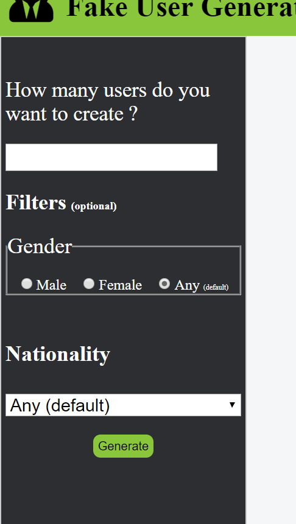
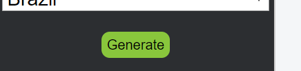
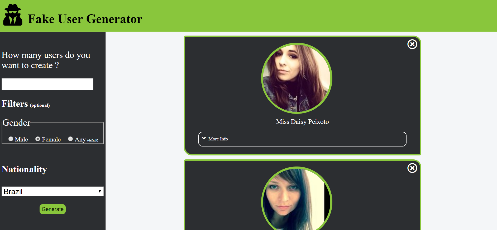
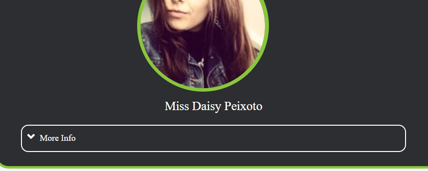
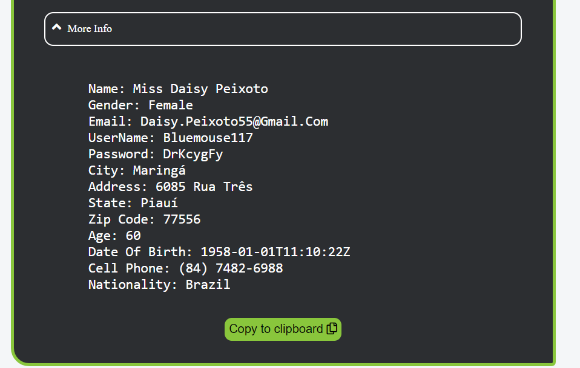

# Fake-User-Generator
<h1>Access the Demo</h1>

Click here to acess the demo ==> https://richigro.github.io/Fake-User-Generator/

<h2>What the app does</h2>
Fake user Generator allows you to quickly and easily create dummy data for your application. This app lets you create users with different nationalities and gender.

<h3>Why I created this app</h3>
This app was created because I wanted an easy way to create dummy data for my applications, to see how my applications would handle mutiple
users at the same time; while at the same time not having real users. This application also serves as a great way to test new new changes that you may want to apply to a real user database but cannot afford to change or lose data while testing.

<h2>Important Notice</h2>
All of the randomly generated data is fake and therefore do not belong to a real person; the source api uses a long list a name given for a nationality and and adress, everything is made up and made realistic by careful selection of each fake users data. All of the images you see in this app are Free Source images and are generated randomly each time the api is called, which can cause duplication of images for a diferrent user in some cases. 

<h2> How to Use </h2>
Using the Fake-User_Generator app is simple, in fact it only takes 4 steps.

Step 1.)
  <srong>To get started using the app click on get started at the bottom of the home page.</strong>
  
  
  
  
  
 Step 2.)
  <srong>Fill out the form on the left hand side of the app</strong>
  The number of users is required while gender and nationality is optional
  
  
   
  
  
  Step 3.)
  <srong>Click on generate at the bottom of the form to generate the desired fake users</strong>
  
  
  
  
  
  Step 4.)
  <srong>And You are Done</strong>
  Now you are able to see your generated users given your specific criteria.
  
  
  
  
  
  <h3>To view More info about your user</h3>
    Simply click on the view more info tab inside each user.
    
    
   
   
   
   
  <h3>Copy the Users Information easily</h3>
   While the more info tab is open click on the copy to cliboard button below, 
   to have a copy of the text ready to be pasted.
   
   
   

<h2>Technologies used</h2>
This application uses the  random user generator api found at: https://randomuser.me/
This application uses images from http://uifaces.com/; a free source collection of user images
This application also uses font awesome for the few icons that are used troughout the app; https://fontawesome.com/.
This application uses a cdn to server a minified version of the jQuery api version 3.3.1 ; https://code.jquery.com/jquery-3.3.1.min.js
No other frameworks are used in this app.
